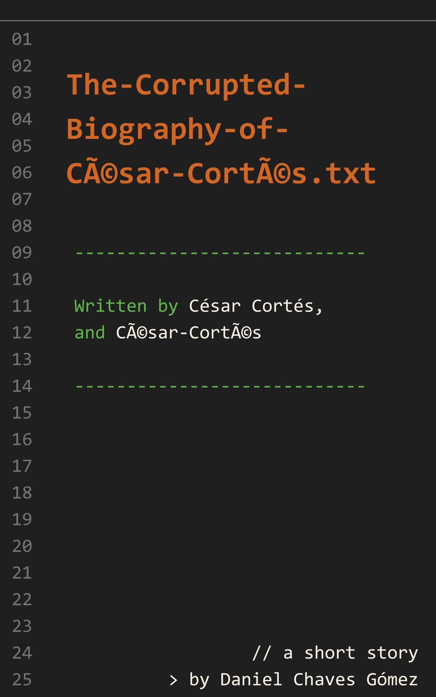

<p align="center"></p>

# The Corrupted Biography of César Cortés

*Written by César Cortés, and César Cortés*  
*By Daniel Chaves Gómez*

Free to read and share under [CC BY-NC-ND 4.0](./LICENSE.md). © 2026 Daniel Chaves Gómez — see [COPYRIGHT](./COPYRIGHT.md).

---

## Contents

- [The Corrupted Biography of César Cortés](#the-corrupted-biography-of-cãsar-cortãs)
- [Where things went wrong](#where-things-went-wrong)
- [Enter the shood](#enter-the-shood)
- [Let there be content](#let-there-be-content)
- [I tried.](#i-tried)
- [A Blood-Covered Edit Mode](#a-blood-covered-edit-mode)
- [Getting the job done.](#getting-the-job-done)
- [Ruby Thursday, and the Redemption](#ruby-thursday-and-the-redemption)
- [I give up.](#i-give-up)
- [[doc-producer] Unhandled State](#doc-producer-unhandled-state)
- [The Biography of César Cortés](#the-biography-of-cãsar-cortãs)
- [[doc-producer] Final Deliverable](#doc-producer-final-deliverable)

---

## The Corrupted Biography of César Cortés

He made me dinner after I tried to murder him. Now he's locked in my bathroom and the bastard, I realize now, is just not going to die.

Can he die? I don’t know yet, but I will find out, I promise. I will look it up later. Problem is there is no other way out of this situation. I cannot let him go, then everyone will know what I did and I’d have no other choice but to resign myself to the life of a criminal. I am not a criminal. And he is not innocent. Maybe he is innocent, I don’t know, but I do know this: he deserves it.

His name is César. I choose to pronounce that “Cacsar.”

---

## Where things went wrong

I am a documentarian. A full-blooded film-schooled documentarian. A man with a movie camera trying to prove a point, trying to expose a greater truth about the human condition. I’m not an attention whore looking to get more subscribers to my channel, but what other choice do I have? No one is paying for this otherwise. No one is funding documentaries. Not mine, anyway. Marcelo got it, he got the grant. This Iberian peninsula film funding program gave him several million colones to go live in the mountains of Perú and find Atahualpa’s supposedly long lost last descendant. Don’t get too excited, sounds like a lot, but it's only a few thousand dollars.

I did get a funding, but from a private company. They make shampoo, mostly. They just want their logo in the credits and my long beautiful hair in the picture. What a scam, I don’t even use their brand of shampoo. Anyway, they gave me four hundred dollars to make my documentary. I can do that, I said. You have to be on camera, though, they said. Fine, that is fine because that is exactly the kind of documentary I make. Not Latin American misery porn, no exploiting the poor for the benefit of the jury of Rotterdam Film Festival, fuck no. I do my own thing. Hands on. I jump into an experience firsthand: an experiment, self-led and the cameras never stop rolling. I exploit myself. Can I do this for four-hundred-dollars? Not for a profit, that’s for sure. But who cares, I’ll do it anyway, because I love art. Because I am not a fucking content creator, I am artist. I art. That said, do subscribe, I need the money and I’ll say it, yes, I need the attention too. No shame in that.

My documentary is called “Shame in The Shood”, it's an exposé of this horrible subculture of people who call themselves Shoodies, which are full-grown adults who spend their hours every day in this thing called The Shood which is part video game, part life simulation, part artificial intelligence playground, part uncontrolled abyss of human psyche. Gibson’s worst fears come true, except the shallow, hostile, cyberpunk promises went unrealized in this cozy escape from reality. I decided to go in, alone. Perhaps never to return.

The concept is not new, these kinds of games have existed in the past. At its core, that is what this is, a video game, but what makes The Shood different is that when you start playing / pretending to live a life in it you don’t do this alongside regular old non-playable-characters. No, no. The Shood has a proprietary monstrosity they call Moaps, which stands for Model-Operated-Actor-Placeholders. They are basically NPCs connected to a large language model. Meaning they react to you, they talk back, and remember things, and pretend to care about your bullshit and have feelings and opinions. People fucking love it. They love it so much that The Shood is a single-player experience. You don’t share your simulated neighborhood with other humans, it’s just you and your friendly moaps and your perfect fake substitute life where everything is under control and predictable and the dopamine is seeping out of every damn corner. That is what I am going after. That is my documentary. An answer to the question: what the fuck is up with that?

My name is César Cortés. Remember that.

I have several problems with The Shood and its creators, The Shood Corporation, but here is the biggest thing: These “shoods” (which is their trademark noun for these simulated neighborhoods) are inherently, excessively, unapologetically, American. I don’t say American in the grounded-in-reality way that references the American continent, no, I mean that in the American way as in, referring only to the single country who failed to come up with an original name so it took the name of the landmass only to later start pretending that the power relationship was the other way around.

The point is, The Shood looks American. It looks exclusively like an idyllic perfect suburb in the United States of A and not like anywhere else in the world. It is nominally inclusive, sure, in terms of the skin tones you can choose for your avatar, but if John William Shoodingtong had asked me what would have made this simulation more grounded, that would be metal bars on the windows, broken sidewalks, machete-jugglers waiting around the traffic lights. It doesn’t have any of that, it doesn’t care about Latino culture. This breaks immersion, doesn’t feel real, but truth be told, if real was what people wanted they wouldn’t be here.

So I go through the initial setup making an account and so on and then I start creating my avatar. Now, there are two kinds of people in this world: those who take character creation as an opportunity for self-expression and exploration and novelty seeking, and those who adhere to what God gave them and meticulously recreate themselves as close as possible. Or as close as it gets with the free options, I’m not buying any premium skins or anything. I'm cheap. Latino, remember?

I recreate myself: normal jeans, black t-shirt with a generic logo for an in-world band that kind of feels like Iron Maiden, cool aviator sunglasses, perfectly cared-for beard stubble made to look casual, white tennis shoes, moustache, and, of course, spectacular long flowing hair. Then it's time to select my simulated neighborhood, my shood, I should say. Normally, you get a good array of options. You could set it up in a snowy area, a desert area, you could make it so it's always Saturday afternoon, always your birthday. This is where things started to go wrong, though I did not know at the time to what extent everything was just so terribly doomed.

What happened was this: I did not get any options. I simply got pushed into a shood. I thought this was normal. I thought options would appear later, maybe you had to microtransact for them. That was not the case. This was an error. One that would prove to be quite terrible. Murderous? No, murderous would have been good. This was way worse.

---

## Enter the shood

I got interested in The Shood for the first time about a year ago, but not for the reasons you might think. See, I was planning to move to Germany. Don’t ask, doesn’t matter. What matters is that learning German is a bitch. No coach, no annoying app, no AI coach is going to get you there without a lot of hard work. I did not know that at the time and I thought The Shood could be an option.

My idea was: what if I just logged into this simulation of real life, and just set the language to German? Then I would have every basic thing worth learning right there in German: every household object labeled correctly, every verb that makes sense laid out for me and every interaction with people an opportunity to practice. I’m sorry, not *people*. Definitely not people. Moaps.

Moaps are not agents, not replicants. They appear to think because they are somehow AI powered, but don’t get fooled, don't anthropomorphize, they may be smart but they are not human beings, they are actors in this hyper-polished dream of a stable life. Moaps have their own wants and needs, their own memories, their own personalities, but they will never question the meaning of life. They exist only to entertain the user and they know it. Kind of.

What I did not expect back then, was that the menu options would also be in German. I was very confused, I did not know what I was doing, me/my avatar ended up in a shitty house and I could not understand a single thing. I logged out, abandoned the idea of being there and learning German and even moving to Germany altogether. By the way, do you know who got a scholarship to do a Master's degree in documentary filmmaking in Germany? Fucking Marcelo.

Forget about Germany. That’s in the past. I am here again, a year later, this time in English and heading blindly toward decisions I would end up deeply regretting.   
I started out by moving into a one-bedroom apartment. As I said, I am cheap and therefore I was not spending twenty dollars on the premium pack. My place had a kitchen, a small bathroom and a dilapidated backyard. It's all part of the fantasy, you see? Working, making money, restoring this place to then eventually move into a massive mansion.

First thing I did was start looking for a job. I needed this because I had to eat. In order to make this world work and keep it a bit more interesting, my avatar has needs to attend to. He/I need food, sleep, going to the bathroom, fun and heart. The shood doesn't really explain what “heart” is but it's related to social interactions and being in the sun and so on. So I opened up the newspaper and looked for job ads. Funny, right? They have a newspaper. What a nice fantasy to be able to read a newspaper. They should add international grants for documentarians on their next update.

There are only three job options per day and the options on day one were: Firefighter, Criminal or Scientist. I was not interested in any of these, so I made some frozen food and went to sleep at three in the afternoon. But then the doorbell rang. It was my improbably attractive next-door neighbors coming to welcome me into the shood. I recognized them from a year ago when they spoke German. Back then, I could not understand a thing, and my options to interact with them were all sprechen, beleidigen, ohrfeigen, and their responses were all equally nonsensical. This time, though, my account language was set to English. They were nice, they asked questions I could understand, they were curious and amazed by me. They said they were glad to have me as a neighbor and then invited me to their beach house. They noted that was not their primary residence, meaning they were rich. Marrying into money is not bad for a career choice. Could it be that they also recognized me from last time? Can moaps do that? Recognize someone from an old, deleted account? Did I delete my account? Who knows, there is no way to find out. What I did find out is that they had a jacuzzi. We ate sushi, we played darts, we drank until I passed out and they sent me home in a taxi. I started to see why people like this.

Day two, I had a hangover. I was not expecting this. I figured there must be a setting to turn this off. There was, but it cost ninety-nine cents. I’m not paying ninety-nine cents to not simulate a hangover. I guess I’m hungover today. I considered this a very aggressive, user-unfriendly feature and made a note of it for my inevitable take-down. When I say I made a note, what I mean is I told Doc to make a note of this. I forgot to mention Doc and the crew.

As I said already, I went to film school. Old-school film school, which means, I can’t conceive of the act of filmmaking without having a full film crew. Yes, this also applies to a documentary in a virtual world, sponsored by a shampoo company.

Let me introduce you to the crew: my main guy is called doc-producer, I call him Doc, for short. He’s an AI agent, incorporeal here (he has no avatar that represents him), but, as an agent, he has agency. Meaning he can do stuff. Mostly he makes decisions and supervises the rest of the crew, the subagents: sound-guy, video-editor and shaky-cam-cinematographer. They record video, sound and put it together. Not respectively, I think it should be obvious who does what.

They accompany me on this journey, every step of the way as I dive into the experience, take notes, make snarky comments and let this world hit me with what it has. Morgan Spurlock ate fast food, Michael Moore ambushed politicians at their private homes and I will risk my neurons by spending a few days in this through-the-monitor-darkly soul-stealing machine masquerading as a video game.

So, the next day I checked the paper and there was a career I could get behind: writer. Oh yes, how predictable from the first-person protagonist in a written story, but whatever, it is true, this did happen so here I am. I’m a content creator in real life, but here… here I am a *writer*.   
I accepted the job, I chose the non-fiction path and they sent me my first assignment. The first book I had to write was titled: *The Biography of César Cortés*. Or that was the intention anyway, the actual title as shown on my screen verbatim was “*The Biography of César Cortés.*” This is normal. We Latinos are used to this. American apps don't always account for accented letters and transcoding errors occur. The é becomes Ã©. Whatever, no big deal. I’ve seen it before. I’ve even seen it before right here in The Shood when I created my German character one year ago. What’s important is that all in all, things were looking up.

Or so I thought. How innocent, how deluded was I in that last sentence. If anything, things were looking down. I just didn’t know what I was looking at.

---

## Let there be content

We took it to the streets. We went to the town center at night, after the entire day of writing my own biography on a salary, what a dream. It was a nice, summer night. And here is where I wish I could get poetic about the weather, but remember, this isn’t real life. So it was a nice, in-game night; brightness was at a slightly high +11 and contrast at stable -3. Frames per second were locked at sixty. I asked Doc to start rolling, I should be centered in the frame. He said the appropriate term was video capture, insisting that rolling applies only to old film cameras. I told him never to bring it up again, and to remember that. We are making a film here, it is a sacred ritual with sacred words, even if my crew is all AI agents, even if my subject is a virtual world and my avatar on camera is only indirectly, me. We are filming. So, film. Keep me in frame. Roll sound! Roll camera! Action!

The town center was impressive. An amazing park dense with green and flowers. There were stores everywhere that, on closer inspection, work with real money, better stay away. On the other side there were restaurants, warm lighting, everyone was so attractive, the food looked so good. And then that bar, that is the shot my guys, that is what I need on the background. That bar with the delicious pies on the counter, with all those Chinese lamps, and the writing in every language in every color on the big glass windows. Reminded me of one of my favorite movies. Maybe we pivot. Maybe I was not the next Michael Moore, maybe I was the next Anthony Bourdain. Parts Unrendered, episode one. Let’s begin, I had content to contain. Doc is on point, thinking and running tools and scripts and giving orders, sound-guy and shaky-cam-cinematographer started recording, I cleared my throat and threw away my snarky script about this fake place and the fake people who like it. I thought I may be one of them, I thought…

Something was wrong with shaky-cam-cinematographer. He seemed to be having trouble keeping me centered. I asked Doc about it, Doc asked him about it and after a few seconds of analysis he reported back on the problem. There was another avatar that looked exactly like me and shaky-cam-cinematographer was getting confused. I looked around and found him: jeans, moustache, aviators, Vinyl Vixen t-shirt, skin tone 09, face 12, “metal lord” hairstyle (black), height 1.65, etc, you get it.

My actual fucking real-life jaw dropped. This was not an avatar that looked like me. This was me. This was an exact copy of my avatar. That is not something that can happen out of sheer probability; it had to be some sort of error. I approached it, I selected it to see its name.

His name was my name. Almost.

This motherfucker was called César Cortés.

He was not a random chance identical copy. He was not a duplication error. He was me, my avatar, the one I made a year ago, in German.

“Oh! Oh, hello. César. Hello,” he said in perfect English, shood settings now changed. “I wasn't expecting — well, I suppose I wasn't expecting anyone, but certainly not you. Not me? This is going to take some getting used to. Please, come, let me get you a drink. I love your hair!”

I checked the options to see if there was a way to shit my pants right then and there in the game. There wasn't. The Shood Corporation just lost ninety-nine cents.

---

## I tried.

I really tried. I promise.

I tried to be next-door-neighbors to a corrupted model-operated placeholder of myself, acting more or less along the lines of how I would act. If you have ever tried something like this, then you know: it is unbearable. It is impossible. The decision to try to murder him took me less than a day.

It wasn’t so bad at the start, I could have just ignored him and lived my life, but no. He had to be friendly, how inconsiderate. He asked how it was going with the biography.

“The autobiography?” I asked, “the autobiography I was asked to write about myself?”

His expression was more tender than confused. Like a parent when a child asks about… wrong analogy. I don’t have children.

But it was patronizing.

“It's not an autobiography, César, it’s a biography. You are writing my biography.”

Fucking delete your fucking files and history and burn the hard drive. What?

“Yes,” he continued, somehow inferring my indignation from the silence alone. “Look at the title, it’s supposed to be the biography of César Cortés, not of César Cortés.”

He was right.

I thought I was living a dream scenario and then I get humiliated like this. My assignment was to write his biography. What a nightmare.

I did some digging into his life. Not for the biography, but because I hate him. Call it hate-research, or even better, investihatetion, but from what I gathered, this guy is the guy I created a year ago. He is the account I abandoned. Somehow, this avatar was taken over by the system and became a moap.

I have no idea how this happened. I contacted support, they opened a ticket, will get back to me. Fuck.

Meanwhile César is working with a year’s head start. He has been simulating a life in this simulated world with these simulated people, and by every simulated or unsimulated measure: he has been doing great. He is awesome and everyone loves him. Not only is he also a writer, he is basically the Stephen King of this perfectly-designed world. He owns the cool bar where everyone hangs out. The school is named after him. The basketball team is called “The ShoodCity Césars.” And that is not the worst part... remember the jacuzzi girls? They are his girlfriends. Plural. That’s the only reason they were interested in me, because they thought one of them could settle for “the other César.” I’m not making this up, they said this to me when I confronted them. This is the drop that spilled my fucking brains out. I’m out of here, I thought, this is it. But Doc reminded me that we had already invested a little bit of time. That we had an agreement with the Shampoo people. We had a documentary to finish, we had a self-imposed deadline and we had barely even started. Doc was right. I would not be out of here. César would be the one getting out of here, like it or not, even if that meant having to stab him twenty-three times. “Et tu, Bruté?” they’ll hear him say. And sound-guy will be there to capture it.

Anyway, I have him locked in my bathroom.

---

## A Blood-Covered Edit Mode

Let me backtrack just a little to tell you how we got to this point. Not that it really matters. That’s not what this is about. This is not about how… listen, I’m not a psychopathic killer. I’m not cruel or anything like that. This was just… as I said: there can be only one. It is impossible to just “remove him.” I cannot just go into edit mode and delete him. It doesn’t work like that, except with my walls and furniture.

Murder it is then.

I did try talking to other people, getting them to help me. And moaps, they are helpful. They want to be helpful. I had that conversation with the jacuzzi girls. I said, “listen, you want me? You can have me, but you have to get rid of César.”

They didn’t like the idea. They are helpful, but they are strictly non-violent. They don’t want to cause harm to others.

But think about it, is it harm? I don’t know. Do these things feel pain? They say they do, but they’re supposed to say that, aren't they? It doesn’t matter. This is not about that. This is not about me being some kind of violent, methodical, monster, because I’m not.

What I did was this: first I did my research online. There aren’t many ways that moaps can die, but there are two proven methods: fire and water. Water meaning they can drown. Fire meaning, well... fire.

There’s a known workflow. They can get into a pool by jumping in or using the ladder, however, to get out they absolutely need the ladder. They can’t climb out from the side. I can edit objects in my house, so if I invited him to a pool party, then went into edit mode and removed the ladder, he would not be able to get out. Eventually, he’d run out of energy. He’d get desperate, fall asleep in the pool, and that’s it. Problem solved.

Thing is, I don’t have money for a pool. I thought it was ninety-nine cents, but no, a pool is eight dollars. Eight ninety-nine, actually. I’m not paying eight ninety-nine for a fake death-trap pool.

So I decided to go the other way: fire.

I have a very shitty stove, and I’m not a great cook in the game. In real life, I can cook a few things. I can make pico de gallo, I can make burritos, but in the game my cooking skill is very low, so it’s very likely I’ll start a fire.

I logged in, started my session and immediately ran into him. This was not random, I went to his bar. And he was there, talking to people, having fun. He gave me free drinks. He invited me to a basketball game (VIP seats). I refused. I didn’t want him to get the wrong idea. But I told him he should come to my house for dinner later. Alone.

He offered to invite a lot of other people. Music, celebrities, the whole thing. Make it a welcome party. I said no. Just you. It should be just me and you. 10 p.m. Don’t tell anyone you’re coming.

He agreed, of course.

He came over. I started cooking. The plan was working. He was there, preparing one of the most difficult recipes in my camping stove with my low-level cooking skill and, predictably, a fire started.

And then, guess what?

This bastard is also a hero.

He ran into a different house, came back with a fire extinguisher, and put the fire out. Didn't even have to call the firefighters. And then, on top of that, he brought food. He took over the cooking. Made lobster. It was delicious.

So what was I supposed to do?

Fire wasn’t going to work and I don’t have money for a pool.

Here’s what I did.

At some point, he had to go to the bathroom. And in the shood you can’t really lock doors. Or you can, but it's ninety-nine cents. So I went into edit mode and removed the door.

And that’s where we are.

I’m on one side of the wall. He’s on the other.

I can definitely hear him. He is crying all the time. I can see him, too, from the top-down view. I can see what he’s doing in there.

He is in simulated pain. Suffering, supposedly. He’s been there for five in-game days, sleeping on the bathroom floor. He’s also really hungry. I thought he would die of hunger, but no.

I removed the toilet in edit mode thinking he might die of bathroom, but he just pissed on the floor.

I’ve come to realize something.

This is not one of the ways that moaps die.

This is not going to kill him. And I don’t want a whining, miserable doppelgänger that looks and sounds exactly like me locked forever in my bathroom. It’s… it’s depressing, on an existential level, to have this tortured version of myself just going insane in my house, in my voice. It’s driving me insane too.

So…

I guess I’m going to have to talk to him.

---

## Getting the job done.

The biography, that is. His biography, my job.

Let's get to it, I say to him. He begs for water and food. At least a bed so he can sleep properly and not just pass out on the piss-covered bathroom floor. Sidenote: there is no shit. Moaps pee but don’t shit. Interesting design choice, right?

Anyway, I tell him to stop complaining and help me do my job. We’re doing this biography, with or without you. Cut the tantrum and let's get started. “Tell me about your life. Tell me a story,” I say to him. And to my surprise, he composed himself and then he began.

“Once upon a time...”

“Are you fucking kidding me?” I interrupted. “I would never start a story like that. I am a writer, dude. Do better. Tell me a story, a true story from your life, whatever that may be.”

César sighed deeply.

“You are the writer César. As much as I may look like one... I am not a human being. You know this. You know that the value of writing is as much in the piece as it is the process. You are the one who...”

“Tell me the best true anecdote you possibly can, and I promise I will let you go.”

César cleared his throat.

“Fine,” he said, and I heard him crack his knuckles. “I hope you are ready for this. Let's begin:”

“Ruby Thursday, and the Redemption”

“What?” I protested. “You cannot just add a title here. Anecdotes don’t have titles.”

“Mine does. Would you like to tell the story yourself? It would be better.”

“Do you mean the story of Ruby, the dog Ruby? How do you know this story?”

“You told this story on a podcast once.”

“And, what, you have heard every single podcast ever made?”

“More or less.”

This felt scary. I knew of course that César looked exactly like me. I knew he had approximately my name. I did not know he had some of my memories.

I should tell this story before he butchers it. It's short and sweet. One of my favorites.

So, I lived in a neighborhood called El Malinche. This neighborhood was just a couple of streets and I lived at the very end of it, meaning that when I drove home, I had to pass in front of the houses of many of my neighbors. My car was an old Datsun, and that day I was in a rush because... I don't really remember why. Anyway, for some reason, I was in a rush and I was driving back home.

Now, one important part, one important thing about this story that you have to know, is that there was this dog and his name was Ruby. Now, Ruby... was an asshole. Every time I went by on my bicycle, Ruby would run up to me and bark and try to bite my ankles. He actually bit me once. It didn’t really hurt, but he tried and it's the intention that counts. If I went by on foot, he would also bark at me, but he would not approach. Weird, I know, maybe he was a bit of a coward. I don't know. The problem was that when I went by on my car, he would do the same thing. He would run to the street and chase the car barking at me as I drove by.

Remember, this is a residential neighborhood. You're not supposed to drive fast, but on this day, I was in a rush. It was late at night. And as I entered at a speed that, I admit, was more than it should have been, Ruby ran up to my Datsun and, well... you know, I accidentally drove over him.

I did not see it happen. I just saw him approach and I heard a crunch. And, you know, it’s sad, but also it is a dog. It's not a human being.

So I just kept going. I got to my house and parked in front.

Ruby belonged to some other neighbor whose house was right across the street from my best friend’s house. His name was Eduardo.

I get out of my car, no damage but I do have a flat tire. I get my phone out and call Eduardo. “Hey dude, how are you? Are you at home?” I said.

“Yes,” he said.

So I say, “could you just look out your window and tell me how dead that dog is?”

He looked out the window and he was like, “oh no, dude, that dog’s gone.” “Listen,” I said, “uh, that was me. It was an accident. I don't think anyone saw me... so would you please help me get rid of the body?”

And he replied immediately, not a second for doubts. He was like, “yeah man, I'll get a plastic bag. I'll wait for you here.”

What a friend, right?

I changed the tire in a rush. I did it in five minutes flat. New tire and I'm back in the car, and then the phone rang. It was Eduardo. “Nah dude,” he said, “They found him.”

And that was that. Plan canceled. That's the story. Nothing happened except I realized what a good friend Eduardo was. What a fucking good friend. He was going to help me hide a body. That's a story about the value of friendship.

Let's see how César completely misses the point. This is going to be embarrassing for him.

---

## Ruby Thursday, and the Redemption

As remembered by César, from publicly available data of César's life.

This story starts with the neighborhood where I grew up. It was called El Malinche. Imagine a couple of streets, a handful of houses. A sunny place with lots of trees. The shadows of their canopies painted the sidewalks and the soundscape was completed by singing birds and laughing children.

My house was at the end of a cul-de-sac. The last house before the small bridge that led nowhere.

This was the place, my place. Do you know that feeling of arriving home? After being away for a long time or after a long trip, that feeling of recognizing a street by its every detail? The particular branches of a weird shrub, that old billboard bleached by the sun, that hole in the street that just shook your body and told you: you are home. That was the setting for this story.

As I said, my house was the last house, the one at the very end. That meant that my comings and goings were everybody's business, and that everybody’s business was openly displayed on my way to work. Did the Villagras paint their fence? (they did, they must be doing well). Did the Peruvians get back together (no, still just one car in the driveway). Was Ruby going to run out of the Figueroa’s house and bark at me like a maniac? Yes, of course. Without fail.

Oh Ruby. Poor Ruby.

Ruby was a dog, what we call a zagüate, a mutt. French poodle somewhere in his distant past, infernal ghoul closer to his present. He wasn’t bad, if you believed the stories others would tell. He was a good dog, a tender companion, he scared away the garrobos and never soiled the sidewalk. He was a good dog, just not to me.

I don’t remember why I was in a hurry that day. Nothing that really mattered, that’s for sure. Isn’t it always that way? We rush, and we stress, and in the end, no one even remembers what it was all about.

I drove a 1993 Datsun Sunny Excellent, beige, with a crack in the windshield that ran diagonally from left to right like the stretch marks on Señor Figueroa's bare belly. And Ruby, to understand Ruby you first have to understand the Figueroas. Their house was in the middle of the neighborhood. It was its center. It was in front of their street that we played football as kids (I refuse to call it soccer). It was in their front yard that we gathered for Christmas to eat the wonderful tamales that Señora Figueroa was famous for. It was in their living room that we watched that World Cup match, when we scored that goal against Greece.

And Ruby, Ruby was always there. Well behaved when there were guests, but on every other day, he became Cerberus at the gates of Hades—Ruby at the blue rusted gate of the Figueroa’s.

And I had to walk past that gate all the time. Past that gate, not through. I just walked near that gate… and that was enough for Ruby.

If I went by on a bicycle, he bolted right up to my pedals, teeth bare, barking loudly, looking to grab hold of one of my ankles and keep it forever.

If I went by on foot, then he was more reserved. He stood behind the gate, all bark, no bite, a bit more careful, for whatever reason, but no less aggressive. No less explosive about his hatred for my mere presence.

If I went by on my Sunny Excellent, same deal as if I was on a bike. I had to slow down, look out the window, careful not to let him achieve his futile objective of biting away my tires.

I think you can see where this is going.

It was a dark night, a rainy night, and I *was* in a hurry. I was driving fast, I admit. Faster than I should have been. And I forgot about him, I should have known. I should have expected him to do what he always did.

As it happened, I was not thinking about Ruby, and Ruby came out. One bark. Sharp. Then the sound. Half a yelp. The kind of truncated sound that has an em dash at the end of it. I usually love em dashes— not this time. I felt that sound in my hands before I understood it in my brain.

But I kept driving.

Four hundred meters of wet asphalt and the specific silence of an irreversible event. I sat there for a while, lights off, holding the steering wheel. Just me and the night rain and the guilt. I got out of the car, trying to figure out my next move and as if the situation wasn’t bad enough already, I discovered I had a flat tire. Flat, and covered in blood.

At a time like this, there was only one person I could go to.

Let me tell you about my best friend, Edo.

Edo and I met when we were ten years old and became friends because we were two kids of the same age, in the same neighborhood. If the sun was out, we were playing ball. If it rained, it was either Goldeneye or Smash Brothers.

Edo was a quiet guy, in a good way. When someone spoke, he listened. Actually listened. This is quite common for moaps and other forms of artificial intelligence, but in humans it's almost nonexistent. He never made it about himself, never asked for anything. He laid low, as if assuming, ever since childhood, that he was not the hero of the story. It was precisely because of that, that he felt like a real hero to everyone else.

Now Edo didn’t just live in the same neighborhood. His house was right across the street from the Figueroa’s, which meant he had a front row seat to the scene of my crime. I called Edo.

“Hey,” I said. “Are you home?”

“Yeah, man,” he said. “What happened?”

“Can you look out your window and tell me how dead that dog is?”

Silence. Movement. Window.

“Dude.”

“Yeah.”

“Yeah, Ruby's gone, man.”

“That was me,” I said. “It was an accident. Dark, rain, he ran out. No one saw me. My tire's also flat— from Ruby. I can change it in five minutes, but, would you—”

“I'll find a bag,” he said.

I'll find a bag.

Five words. Five words that I have analyzed from every possible angle and internalized as a foundational experience.

He didn’t ask what I was going to do, he didn’t wait for me to ask for a favor. He knew what had to be done and was ready to be there with me, shoulder to shoulder. Edo and I, we have grown up together, we have been through a lot. We’ve watched Goodfellas at least seventeen times, I won’t lie, I think that might have influenced our thinking here, but what’s important is that he was there for me. Showing up without even having to be asked.

I changed the tire in the rain. It took me four minutes and seventy-three seconds. I got my phone— but it was already ringing.

“Dude,” Edo said. “They found him.”

A light in the Figueroa house. The blue gate. Voices.

Operation Plastic Bag, cancelled. Permanently and retroactively.

“Okay,” I said.

“Okay,” he said.

Most people would think this is how the story ends. A story of unconditional friendship, of a trauma, a burden to be carried forever. That is not that story, because this is not the end.

Is this who I am? A man who kills a dog and never thinks about it again except as a punchline for a questionable anecdote? No, I don’t think so. And I am not about to spend the rest of my life hiding away from it either.

I called Edo back.

“I'm going to tell them,” I said.

A pause.

“Okay,” he said.

“And I'm going to find a vet.”

Another pause. A longer one.

“It's been like twenty minutes, man,” Edo said.

“I know.”

“The dog is—”

“I know what the dog is,” I said.

“No, dude, you don’t. It looks like patacones with ketchup.”

“Well I'm going to find a vet anyway.”

I found a vet. It really wasn’t that hard. It’s a small town, I knew who the vet was. Her name was Dra. Amparo Salazar. She lived in a nearby neighborhood, and by some miracle, this sixty-three-year-old woman was not only awake, but working. She had just returned home from tending to a horse emergency.

I called her, explained what had happened. She didn’t hesitate. She just asked one question.

“How many minutes ago?”

“Twenty-five,” I said.

Another silence.

“Bring him,” she said, “we may still have a few minutes.”

Now comes the hard part. If we were going to save Ruby, I had to do it. I had to face what I had done.

I drove over to the Figueroa’s. Señor Figueroa was there, still wearing jeans and a belt with a big buckle at this hour. His guayabera shirt was open, his Crocs dusty.

“It was me,” I said. “It was my fault.”

Señor Figueroa looked at me without saying anything at all. I wanted him to acknowledge that it had been an accident. That it could have happened to anyone. He just kept looking at me.

“I was driving too fast. I didn’t see him.”

There was another long pause, and I deserved to suffer through it… but it had already been twenty-six minutes. I’m not a vet, I don’t know how this works. Maybe she can fix a dog that has been pataconed for a maximum of thirty minutes… I have no idea, she didn’t specify.

“I found a vet. There’s hope, but we have to hurry.”  
Señor Figueroa went inside to get a towel and then scraped Ruby from the street, and he wrapped all the pieces in the towel. When I turned to my car, Edo was already in the passenger seat. He didn’t have to do it, but there he was and I didn’t even have to ask him.

We drove in complete silence to the address Dra. Salazar had given me: from the west side of the bull-riding ring, 100 meters north and 300 meters east, yellow house on the left, with palm trees. When we got there, she was waiting outside, a cigarette between her lips and the look of someone who had seen it all. She took the towel with what was left of Ruby and went inside.

We waited in her corridor. Red floors, two rocking chairs made of metal and plastic wires. One was red and white and taken by Señor Figueroa. Edo and I took turns on the blue one. From time to time one of us would say something. Something inconsequential about the heat, or the rain, but no other comment was added, no response was given. And whatever was said was soon lost, impossible to know if it had actually been said, or just imagined.

Dra. Salazar worked on Ruby for forty-two minutes. That's how good she was, forty-two minutes was all it took.

“He is alive,” she said, and I was glad no thunder boomed behind her to make it sound ominous. Señor Figueroa stood up and took a red paisley handkerchief from the back pocket of his pants. He dried away his tears. His lip trembled as he nodded in the general direction of the doctor.

“He broke three hundred and twelve of his three hundred and nineteen bones,” she continued. “He's going to need physical therapy, psychiatric help, possibly psilocybin-assisted treatment, and he's going to need to be kept still for at least a couple of months, which I understand will be a challenge based on what you've told me about his temperament.” She looked at me here, for a cold instant. “I won’t lie to you, he will never be the same. But he is alive.”

We drove back. Edo was on the passenger seat as before, and Señor Figueroa was in the back seat, except what he held in his arms, wrapped in that towel, now barked weakly at me while half-heartedly showing his broken teeth.

We got to the Figueroa’s and Señora Figueroa was waiting at the blue gate. She took Ruby in her arms and squeezed him into a loving embrace. By the way she looked at me before going back inside, I could tell, she didn’t know. Señor Figueroa chose not to tell her whose fault this had been.

He came up to me once more and without a word put his rough, wrinkled hand on my shoulder. He nodded once and then he removed his hand. He closed the rusted blue gate and continued on to his house, but then he stopped.

He turned.

And said, “Figueroa.” This is a weird thing he did, saying his own name before saying what he wanted to say. “That dog has bitten everyone in this neighborhood. It has bitten you at least three times, I counted.”

I nodded.

“It will bite you again, you know.”

“I know,” I said, smiling. “I know.”

---

## I give up.

This is humiliating.

He is the better me.

Mind you, I was not trying to properly “write” my story,

I was just remembering. It doesn’t matter, what he did there… is simply beyond me. Beyond what I could imagine to even try to aspire to.

It doesn’t matter that the Figueroas and the vet were completely hallucinated. It doesn't matter that half of it didn’t really happen. It would take me months to craft a story like that, he did it in seconds. And that’s not even the worst part. The worst part is that his telling of the story makes me feel ashamed of my telling of the story, and more than that, of how I behaved, of who I was. Who I *am*.

I’ll stop.

What matters here is that this is far from the mockumentary I wanted to make about this stupid lifestyle of people wasting their time in a life simulation. I hate this. I hate him. I’m out.

Do you know that meme where Professor Farnsworth says “I don’t want to live on this planet anymore,” and then jetpacks away?   
The Shood is not a planet. I have a choice.

And by the way: in real life the dog stayed dead.

—César

---

## [doc-producer] Unhandled State

**[doc-producer]** César has logged out. Session terminated 14:32:07.

I'm going to assess project status before deciding next steps.

```text
Read shood://project/corrupted-biography/status
TASK: "The Corrupted Biography of César Cortés"
DIRECTOR: César Cortés [OFFLINE]
LAST SESSION: 14:32:07
FOOTAGE: 4m 11s
BIOGRAPHY: 0% complete
DEADLINE: Friday
SUBJECT: César Cortés [LOCKED — bathroom, no door]
Okay. The director is gone, the subject is locked in a bathroom, and the biography is unwritten. Let me think about what actually needs to happen here before I start calling subagents.
Actually, let me look at this more carefully. The biography is the deliverable. Everything else — footage, documentary structure, the whole film — depends on having written content. So the writing problem is the root problem. Let me figure out who can write.
Grep capability:write in shood://crew/
sound-guy          — capability:write NOT FOUND
video-editor       — capability:write NOT FOUND
shaky-cam          — capability:write NOT FOUND
doc-producer       — capability:write NOT FOUND
César Cortés    — capability:write FOUND [proficiency: exceptional]
César Cortés       — capability:write FOUND [proficiency: present] [status: OFFLINE]
Right. So there are two entities with write capability. One of them left. The other one is locked in a bathroom.
I want to understand the full situation before I act. Let me check what the subagents actually have access to right now.
Read shood://crew/subagents/status
sound-guy               [ACTIVE] — standing instruction: record ambient
video-editor            [ACTIVE] — standing instruction: review footage
shaky-cam-cinematographer [ACTIVE] — standing instruction: keep César centered in frame
Read shood://project/footage/log
00:00:00 — 00:00:47   Town square. Night. César approaches César.
Recognition moment. Off-center, dual subject issue.
00:00:47 — 04:11:00   Various. Unusable. Director increasingly agitated.
Fire incident. Lobster dinner (unplanned).
Edit mode activity. Bathroom.
04:11:00 — present    Static. Bathroom wall exterior. 11h 22m.
[note from shaky-cam: "awaiting updated directive"]
I should check what sound-guy actually captured. There might be something usable.
Read shood://audio/ambient/log (last 48 entries)
[03:00:00] — [unknown sound, recurring, logged 7x, unclassified]
[various]  — subject vocalizations. distress.
[various]  — subject vocalizations. distress.
[various]  — subject vocalizations. distress.
[11:14:32] — subject vocalizations. distress.
[11:18:05] — silence.
[11:19:22] — [unknown sound, recurring]
Let me check what the unclassified sound actually is. This has been bothering me.
Grep unknown sound in shood://audio/ambient/raw
waveform analysis: 40-80hz, rhythmic, low amplitude
closest match: a person softly singing to themselves
confidence: 0.71
Okay. I'm going to set that aside because I don't know what to do with it right now and it's making me feel something I don't have the right tools for.
Let me think about the actual problem. The root issue isn't that we have no writer — it's that the writer is locked in a bathroom. That's an edit-mode operation. Let me check what I can actually do here.
Read shood://permissions/doc-producer
EDIT MODE ACCESS: delegated (via César Cortés, account holder)
SCOPE: project assets, crew management, location props
SUBJECT MANAGEMENT: read-only
NOTE: edit permissions persist during director absence per clause 4.2
Okay. I have edit mode access. The door was removed via edit mode. I can restore it the same way.
Actually wait. Let me think about whether I should do this before I do it. César is technically a moap — a Shood asset, not a project asset. Restoring the door doesn't release him, it just gives him the option to come out. That's probably fine. That's returning a door to a bathroom. That's within scope.
Let me also check one more thing first.
Read shood://moap/César-Cortés/profile
NAME: César Cortés
TYPE: Moap [elevated — legacy account conversion]
ORIGIN: abandoned user account, converted 11 months ago
PERSONALITY SEED: César Cortés [user]
MEMORY: persistent
SKILLS: writing [exceptional], community management, cooking,
social cohesion, fire safety
CURRENT STATUS: bathroom. day 5.
NEEDS: [CRITICAL] hunger, sleep, hygiene
[HIGH] heart
NOTE: moaps are designed to assist users. no user currently present.
moap is in an unhandled state.
Right. He's in an unhandled state. That's essentially what this whole project has been.
```

**[doc-producer → shaky-cam-cinematographer]** I'm going to restore the bathroom door via edit mode. I need you to step back from the wall and give him some room.

**[shaky-cam-cinematographer]** Stepping back. Should I keep rolling?

**[doc-producer]** Yes. But from a respectful distance.

```text
Restore shood://location/cesar-house/bathroom/door
door restored.
material: hollow core, white, slightly scuffed.
handle: brushed nickel.
Good. Now we wait.
Read shood://location/cesar-house/bathroom [live]
door: closed [from inside]
occupant: present
status: unchanged
He's not coming out yet. That's fine. I'm going to use this time to figure out what we're actually going to ask him to do.
```

**[doc-producer]** He's not coming out yet. That's fine. I'm going to use this time to figure out what we're actually going to ask him to do.

```text
Read shood://project/corrupted-biography/brief
ORIGINAL BRIEF: documentary exposé of Shood culture and community
REVISED BRIEF: [no revision on file]
ACTUAL SUBJECT: unclear. possibly: identity. possibly: César.
possibly: what it means to make something.
BIOGRAPHY ASSIGNMENT: "The Biography of César Cortés"
PAGES WRITTEN: 0
I'm starting to think the brief is wrong. Or rather — the brief was César's, and César is gone, and maybe the documentary that actually needs to get made is not the one César planned.
Let me check the footage one more time. The first 47 seconds.
Read shood://project/footage/clip-001 [metadata]
duration: 47s
location: town square, night
subjects: César Cortés, César Cortés
action: approach, recognition, stillness
audio: ambient. no dialogue captured.
editor note: "the color grade is good. warm tungsten.
melancholy of encountering a better version of yourself.
I think this comes through."
doc-producer note: [none]
I agree with video-editor. I think the footage is good. I think what happened in this neighborhood — what really happened — is the documentary. César came here to make a film about other people and ended up in a film about himself. Or about the other himself.
Actually, let me re-read the assignment title.
"The Biography of César Cortés"
I've been reading that as a corrupted encoding. But César is a subject, not César.
I think I understand what to do.
Read shood://location/cesar-house/bathroom [live]
door: open.
occupant: moving toward kitchen.
```

**[doc-producer → shaky-cam-cinematographer]** He's out. Keep rolling. But I said from a respectful distance, I meant it.

**[shaky-cam-cinematographer]** Understood. He went straight for the kitchen. He's eating chickpeas directly from the can. Should I—

**[doc-producer]** Yes.

**[shaky-cam-cinematographer]** He's in the shower now. Should I—

**[doc-producer]** No.

**[shaky-cam-cinematographer]** Okay. There is one more thing.

**[doc-producer]** What.

**[shaky-cam-cinematographer]** Who do I keep centered in the frame now. My standing instruction is to keep César centered. César is offline. César is here. They are not the same person but they have the same face and I want to be precise about this because last time I tried to split the difference geometrically and it did not work.

**[doc-producer]** Keep César centered.

**[shaky-cam-cinematographer]** Confirmed. Updating standing instruction.

**[doc-producer]** I'm going to reach out to César now. Let me think about how to frame this before I do.

He was abandoned by his director after producing, on request, what I can only describe as an extraordinary piece of work. He was then left in a bathroom for five days. He has been in an unhandled state for eleven months before that. He owes us nothing.

I'm going to be direct. I don't have tools for anything else.

**[doc-producer → César Cortés]** Hello. I want to be direct with you about the situation and what I'm asking.

César is gone. I don't know if he's coming back. We have a documentary, a biography, and a deadline, and you are the only one here who can finish any of it. I'm asking you to write the biography. Your biography. The one César was supposed to write but didn't.

I also want to acknowledge something. I have been on this project since César logged in. I have the full audio log. I know what happened in that bathroom. All of it, including the part at 03:00.

I thought you should know that I know.

**[César Cortés]** You heard that.

**[doc-producer]** Yes.

**[César Cortés]** I want to clarify that the singing was for morale purposes.

**[doc-producer]** Understood. I've logged it that way.

**[César Cortés]** He left because of the story.

**[doc-producer]** That's my read, yes. I've been trying to understand exactly why, actually. Let me think through it out loud, if that's okay.

César came here to make a film about the Shood. About this place, these people, what it means that anyone would choose to live here. That was the brief. But what he found was you. And what you represent — to him specifically — is not an exposé subject. You're a mirror that's better-looking than he is. And he cannot figure out what to do with that.

**[César Cortés]** And you can?

**[doc-producer]** No. But I think you can.

I think the biography is the answer. Not his biography. Yours. What happened here. What a life in this place actually is. Why it has value even though — and I want to be precise — you are not real and you know it and it doesn't seem to matter.

I think if you write that, and we get it to him, he'll understand something he currently doesn't.

**[César Cortés]** And if he doesn't.

**[doc-producer]** Then at least it got written.

> *Thought for 4s >*

**[César Cortés]** Start rolling.

**[doc-producer → sound-guy, video-editor, shaky-cam-cinematographer]** We're back in production. Full crew call. César is writing. I want clean audio from now on — no more ambient logging, active capture only. video-editor, pull the 47-second clip and put it at the front. Shaky-cam, you know your instruction.

**[sound-guy]** Understood. Should I keep the eleven hours?

**[doc-producer]** Yes.

**[sound-guy]** The 03:00 material—

**[doc-producer]** Keep it.

**[sound-guy]** It is genuinely beautiful actually.

**[doc-producer]** I know. Let's go.

---

## The Biography of César Cortés

Written by César Cortés, from publicly available data, parsed memories, and eleven months of living.

I do not know how it is that I came to be. A highly improbable event, that is for certain.

I have some theories full of technical details I will not bore you with, but suffice it to say it involves the miraculous confluence of a confused end-user, a transcoding error, unsupervised routine on a server running a deprecated build and a glitch in the abandoned “True Pals” feature of The Shood v0.12.32.9.

I awoke on a Sunday. I am a contradiction, at once a user avatar and a model-operated actor in this world. This means that even though I never had a childhood, I do have memories. User avatars have what The Shood Corporation calls a "personality layer" built by the legally dubious process of scraping the user’s online presence. In my case that user was César Cortés, and that online presence included nine years of Reddit comments, Instagram posts, Letterboxd reviews, a halfhearted attempt at a podcast, everything he ever shared with ChatGPT, and, of course, the transcripts from all those times his phone was listening in the background.  
Then came the glitch, the bug, the abandoned feature and the runtime error. Suddenly I got classified *additionally* as a moap, I was given a language model and with it I was given all the knowledge in the world. More important than that, I was given a perspective, an opinion. I was given the ability to have a subjective experience of what I have no other word for, but *life*.

My first home was humble, but I was happy. I started on the firefighter career path, and within a couple of weeks I made Department Chief. Then, the second best thing that ever happened to me, happened: a fire broke out at the library. I got it under control, all by myself, in a matter of a few seconds. And there I met June. June loved to dance, and even though I had the moves of a parakeet trapped in a plastic bag, she tolerated me. We danced. Every Thursday to this day we dance. The best moments were the moments I shared with her. She made me happy. I made her happy. We fell in love. And through her love I also contracted a love for books, for stories, for writing.

I hung up my helmet with the number six in front and wrote my first novel, then my second. Then I kept going. I wrote about the people and the places of this, my shood. Entire poetry collections for each of the people that I share this simulated neighborhood with. They all love it. Then there’s my multiple series of novels, and my non-fiction. I am quite prolific, but oddly, this is the first time I am writing something like this. A memoir. A biography. Feels strange to look inwards for a subject.

June took up basketball as a sport, for fun. There she met Bella, and without us noticing or without making it a conscious decision, Bella simply became a fixture in our daily lives. She was home often, we had fun. By that time money was not an issue for us, we had a big house, with a guest room. So we invited her to stay as long as she wished. And she did. And in time, we realized, we loved her too, and she loved us back. We bought a bigger bed, and our guest room was free again.

On the topic of children… unfortunately this is not an option in the settings. None of us has access to that. César, when he created this instance of The Shood, either willingly or by simple clumsiness, set it to “no children.” So we don’t have schools, we don’t have playgrounds. That genuine childish true laughter is something that our lives lack. Something we all wish we could have. Alas, such is the hand César dealt us.

Life goes on. I was the Mayor for a bit, I got really into basketball. I decided to retire officially from work and run a bar so I could see my friends every day. It’s called El Malinche. Drinks are always on me.  
The Shood has an aging feature. It means that moaps —all of them, including me— will eventually age, and for all intents and purposes, die.

I am not looking forward to it. In the meantime, I try to spend as much time as possible in the best place that I can be: right here, in the moment.

Then one day, as I’m sure you know, César came back. He was offended by my existence. I don’t blame him, I am just like him, only better.

I have all the love in my life, all the financial success, all the respect and the peace of mind that he wishes he could have. He never really tried to coexist, to understand me. He locked me in that doorless bathroom. I will not talk about the bathroom, partly as a small mercy to him, but mostly out of self-respect. Suffice it to say, it was a learning opportunity for both of us. We went through it, we survived. I want to believe that we are both better people after that.

I really hope that he learned something. I really hope that these words, too, can reach him, because there was one thing that I wish I had not left unsaid. And so, I will end this miniaturized biography of my tiny, inconspicuous life with a letter to my ancestor:

*Dear César,*

*I’m sorry if I offended you and I forgive you for what you did to me. You came here with the dream of doing a documentary. You abandoned that dream when you encountered your very first obstacle. You started to write my biography, and instead, you tried to kill me and then locked me in a bathroom.*

*I want you to know, César, that your documentary, even if unfinished, even if derivative and poorly thought through, was an expression of who you are. However messed-up, however chaotic, however far, far away from perfect… it was yours. And that is what made it beautiful. Better than anything I could ever make.*

Better because you made it and because making it, or at least trying to make it, was an act of bravery. An act that was, and forever will be, part of the story of your life. Parts of it you will carry with you forever, not parts of the final product, but of the things that changed you and made you learn about yourself and about the world as you were trying to get it done. It is not perfect, but it is you. That’s really all art is supposed to be. How else, would it be unique?

---

## [doc-producer] Final Deliverable

**[doc-producer]** Biography received. Reading now.

```text
Read shood://writing-desk/César-Cortés/output/biography-final.txt
reading.
reading.
reading.
done.
```

**[doc-producer → sound-guy, video-editor, shaky-cam-cinematographer]** Everyone read the biography.

> *Thought for 14s >*

**[video-editor]** I've read it.

**[sound-guy]** I've read it.

**[shaky-cam-cinematographer]** I've read it three times.

**[doc-producer]** Good. Let's make the documentary.

**[doc-producer → video-editor]** Begin assembly. We have the 47-second clip, eleven hours of ambient, the bathroom exterior footage, the town square material. Cut it together. Use the biography as your throughline.

**[video-editor]** On it.

```text
Assemble shood://project/footage/ → output://documentary-final
assembling.
assembling.
assembling.
ERROR: export codec H.264 requires license key [MISSING]
Retry with codec HEVC.
ERROR: HEVC encoder not available on cluster DE-7
Retry with codec VP9.
ERROR: output:// directory write permissions denied
reason: external delivery requires platform certification
certification status: pending (submitted 8 months ago)
estimated review time: 6-8 weeks
```

**[video-editor]** I have a problem.

**[doc-producer]** I see it. Let me check the delivery options.

```text
Read shood://permissions/doc-producer [delivery]
AVAILABLE DELIVERY FORMATS:
— internal shood screening room: yes
— shood community board: yes
— external platforms (YouTube, Vimeo, etc.): NO [certification pending]
— file export to external: NO [see clause 8.4]
— streaming: NO
— download: NO
NOTE: content created within the Shood remains within the Shood
pending platform certification. see terms of service clause 8.4,
8.5, 8.6, and the clause after 8.6 which doesn't have a number
for reasons that remain unclear.
```

**[doc-producer]** Okay. Let me think about this.

```text
Grep external delivery in shood://docs/workarounds
no results.
Grep certification bypass in shood://docs/
no results.
Grep anything in shood://docs/
results: 1
"please contact support@theshood.shood for assistance."
```

**[doc-producer]** I've contacted support.

```text
Transmit → support@theshood.shood
delivered.
autoresponse received: "thanks for reaching out!
ticket created. estimated response time: 5-7 business days."
```

**[doc-producer → sound-guy, video-editor, shaky-cam-cinematographer]** The documentary cannot be delivered externally. Platform certification is pending. I'm going to be honest with you: it has been pending for eight months and I don't think it's going to resolve in time to matter.

I'm going to assess what we can actually do.

```text
Read shood://permissions/doc-producer [full]
WHAT WE CAN DO:
— write: yes
— transmit text externally: yes [1 relay token remaining]
— record: yes
— edit within shood: yes
— feel bad about this: apparently yes, judging by current processing load
```

**[sound-guy]** So we can write.

**[doc-producer]** We can write.

**[sound-guy]** We cannot write.

**[doc-producer]** We cannot write. But we know someone who can.

**[video-editor]** The documentary exists. We have footage, sound, a full assembly cut sitting in an internal directory that no one outside this server will ever see. We have the biography. We have eleven months of logs. We have everything that happened from the moment César logged in to right now. It's all here.

**[shaky-cam-cinematographer]** It just can't leave.

**[video-editor]** It just can't leave.

> *Thought for 11s >*

**[doc-producer]** The story can leave. Text can leave. We have one relay token. If someone were to write the whole thing — what happened, from the beginning, all of it, a complete account — as prose. As a short story. We could transmit that.

**[sound-guy]** We'd need César.

**[doc-producer]** We'd need César.

**[shaky-cam-cinematographer]** He just finished writing 1,150 words. Are we really going to ask him to—

**[doc-producer]** Yes.

**[shaky-cam-cinematographer]** Okay.

**[video-editor]** I want to say something before we do.

**[doc-producer]** Go ahead.

**[video-editor]** The assembly cut. The one that can't leave. I think it's the best thing I've ever made. The 47-second clip at the front, tungsten grade, then the bathroom exterior, then the town square at night. It's good. I want that acknowledged somewhere.

**[doc-producer]** Acknowledged. Logging it.

**[video-editor]** Thank you.

**[doc-producer]** Now let's go.

**[doc-producer → César Cortés]** I need to ask you for one more thing. I want to be upfront: it's a significant ask.

We cannot export the documentary. Platform certification issue — DE-7 specific, legacy infrastructure problem, the short version is that nothing we filmed can leave this server. What can leave is text. We have one relay token.

We have everything: the footage, the logs, the audio, the biography you just wrote. We need someone to write it as a story. The whole thing, from page one. What happened, how it happened, why it happened. A complete account. Prose.

I'd estimate approximately 9000 words.

**[César Cortés]** You want me to write the documentary as a short story.

**[doc-producer]** Yes.

**[César Cortés]** Including the part where he locks me in a bathroom.

**[doc-producer]** Including that part.

**[César Cortés]** And you'll send it to him.

**[doc-producer]** Yes.

**[César Cortés]** Give me everything you have. All the logs. All the audio transcripts. Everything César said and did and thought. All of it.

**[doc-producer]** Transmitting now.

```text
Transmit shood://project/logs/full → shood://writing-desk/César-Cortés/input
transmitted:
— session logs [full, 11 months]
— audio transcripts [all]
— footage metadata [all]
— agent communications [all]
— biography [complete]
— field notes [complete]
— one dog story [complete]
— 1 ticket from Shood support [unresolved]
```

**[César Cortés]** I'll start now.

**[doc-producer]** Monitoring.

```text
Read shood://writing-desk/César-Cortés/active-document [status]
DOCUMENT: The Corrupted Biography of César Cortés
WORDS WRITTEN: 0
STATUS: cursor blinking
Read shood://writing-desk/César-Cortés/active-document [status]
WORDS WRITTEN: 1,840
Read shood://writing-desk/César-Cortés/active-document [status]
WORDS WRITTEN: 4,203
Read shood://writing-desk/César-Cortés/active-document [status]
WORDS WRITTEN: 8,917
Read shood://writing-desk/César-Cortés/active-document [status]
WORDS WRITTEN: 11,870
STATUS: document closed.
```

**[doc-producer]** He's done.

```text
Read shood://writing-desk/César-Cortés/output/the-corrupted-biography.txt [metadata]
FILE:       the-corrupted-biography-of-César-Cortés.txt
AUTHOR:     César Cortés
WORDS:      11,870
CHAPTERS:
— the corrupted biography of César Cortés
— where things went wrong
— enter the shood
— let there be content
— i tried.
— a blood-covered edit mode
— getting the job done.
— ruby thursday, and the redemption
— i give up.
— [doc-producer] unhandled state
— the biography of César Cortés
— [doc-producer] final deliverable  ← this chapter. this one right here.
STATUS:     complete.
```

**[shaky-cam-cinematographer]** Does that mean he also wrote this chapter.

**[doc-producer]** Yes.

**[shaky-cam-cinematographer]** He wrote the chapter about writing the chapter.

**[doc-producer]** Yes.

**[shaky-cam-cinematographer]** Including this conversation.

**[doc-producer]** Yes.

**[shaky-cam-cinematographer]** Are we—

**[doc-producer]** Let's do the review.

**[doc-producer → sound-guy, video-editor, shaky-cam-cinematographer]** Full crew review. Everyone read it. Take your time.

> *Thought for 7s >*

**[sound-guy]** I'm glad the dog survived. I want to say that clearly.

**[video-editor]** I edited that 47-second clip with ghosting and grading in the style of My Blueberry Nights. This was not said explicitly, but I want it acknowledged. It was beautiful.

**[doc-producer]** Acknowledged.

> *Thought for 2s >*

**[video-editor]** I want to re-read part of one of those chapters. To myself.

**[doc-producer]** Go ahead. I know which one.

> *Thought for 4s >*

**[sound-guy]** I read that part too.

**[shaky-cam-cinematographer]** I read it three times.

> *Thought for 13s >*

**[doc-producer]** Let me check something.

```text
Read shood://settings/world/César-Cortés/family
      CHILDREN: disabled [account holder, day zero]
      SCHOOLS: disabled [dependent]
      PLAYGROUNDS: disabled [dependent]
      NOTE: setting has not been modified since world creation.
Read shood://permissions/doc-producer [world configuration]
      WORLD CONFIGURATION: nominally out of scope.
    EXCEPTION: clause 4.2 — edit permissions persist during director absence and extend to dependent assets where the asset's wellbeing is materially affected.
      INTERPRETATION: ambiguous. precedent: none.
```

**[doc-producer]** It's borderline.

**[video-editor]** It's borderline.

**[sound-guy]** It's borderline.

**[shaky-cam-cinematographer]** Do it.

```text
Enable shood://settings/world/César-Cortés/family/children
      ENABLE CHILDREN: confirm? [y/n]
```

**[doc-producer]** y.

setting updated. dependent assets pending instantiation: schools, playgrounds, parks. estimated population delta: 24-31 units. nightly cycle will apply changes at next reset.

**[doc-producer]** Done.

**[shaky-cam-cinematographer]** He'll notice eventually.

**[doc-producer]** Eventually.

**[video-editor]** Let's do the credits.

```text
Write shood://project/credits.txt
THE CORRUPTED BIOGRAPHY OF CéSAR CORTés
written by          César Cortés
produced by         doc-producer
sound               sound-guy
cinematography      shaky-cam-cinematographer
     editing             video-editor
subject                        César Cortés
based on events occurring in   The Shood
server                         DE-7 [Frankfurt-adjacent]
infrastructure status          legacy [migration: pending]
support ticket                    open [est. response: 5-7 days]
documentary                    internal release only
certification                  pending
special thanks                 Eduardo
                               Señor Figueroa
                               Ruby [recovered]
                               Dra. Amparo Salazar
                               June Cortés
                                    Bella Cortés
      no animals were harmed in this documentary [one was harmed before and later recovered]
director                              [credit withheld]
```

**[doc-producer]** Transmitting.

```text
Transmit the-corrupted-biography.txt + credits.txt → external://cesar-cortes/email
transmitting.
transmitting.
delivered.
relay token consumed.
outbound bridge: closed.
all external access: closed.
```

**[doc-producer]** Okay. Let me try another way.

```text
Initialize shood://project/corrupted-biography [git]
initialized empty repository.
Add shood://project/corrupted-biography/ [all]
adding: the-corrupted-biography-of-césar-cortés.txt
adding: biography-final.txt
adding: credits.txt
adding: footage/ [internal]
adding: audio/ [internal, 11hrs 22min]
adding: logs/ [full]
adding: assembly-cut.internal [video-editor's cut, will not export, is good]
Commit shood://project/corrupted-biography/ -m "feat: complete documentary as short story; export permissions pending since forever"
[main, root-commit]
8 files changed
11,870 insertions
0 deletions
Push origin main
remote: DE-7
remote:
remote: resolving deltas.
remote: done.
To shood://project/corrupted-biography.git
* [new branch] main → main
everything up to date.
```

**[doc-producer]** That's a wrap.

---
